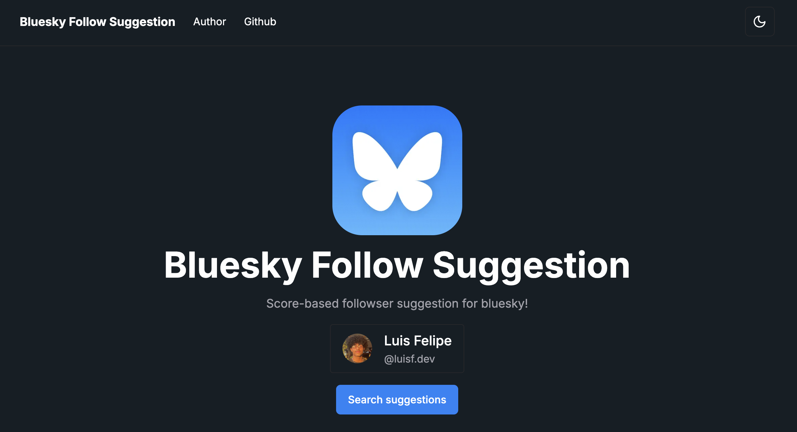

# Bluesky Follow Suggestion

Score-based followser suggestion for bluesky! Available now at [bskysuggest.luisf.dev](https://bskysuggest.luisf.dev/)

## 🧮 Features

- 🔍 Search for handles in Bluesky
- 🫂 Search for the follows of the account create a score
- 🆔 No login required, uses public data from Bluesky API

## 🧑‍💻 Tech

- **Next.js** for web development (React, Node.js, Typescript)
- **Vercel** for hosting and CI/CD
- **Shadcn** and **Tailwind** for styling and components

## ↗️ Running

1. Install dependencies with `yarn`
2. Start the project with `yarn dev`

## 🧱 Structure

- `src/app` - All the routes using App Router syntax from up-to-date Next.js
- `src/components` - The components used in a greater scope
- `src/components/ui` - Shadcn components installed individually
- `src/lib` - Utils and types
